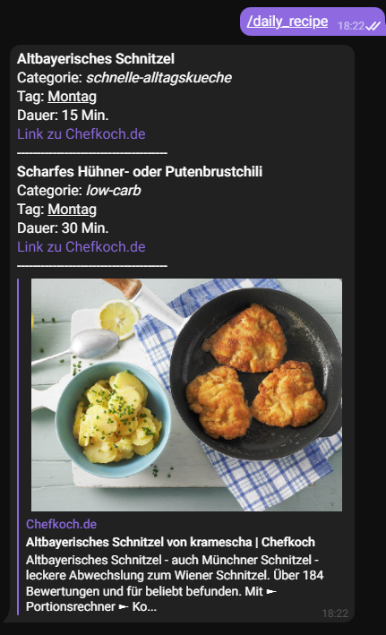
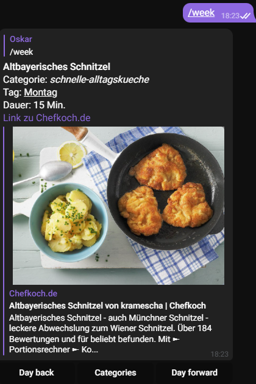

# chefkoch_telegram_bot
- this is an small application which displays the Recipe of today in telegram chat.
- the recipes are provided by an API which also collects the recipes from chefkoch.de
- [Unofficial Chefkoch.de API](https://github.com/Oskar1504/chefkoch_scrap.git)

## Usage
- clone repository

- create .env file
```dotenv
TELEGRAM_TOKEN=<YOUR_TELGRAM_BOT_TOKEN>
```
- start in dev mode
```bash
npm run dev
```
## commands
/daily_recipe
- Returns todays recipe of the day for every categorie

/week
- opens an "menu" where u can choose between all categories and 
browse the recipes for each day in the week using appended buttons


## images

